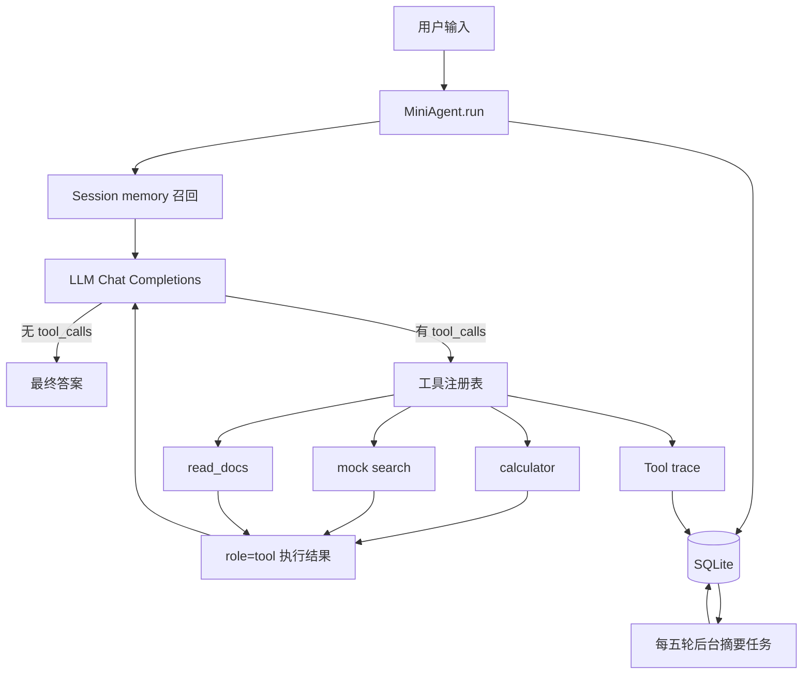

# 从 0 实现最小 Tool-Calling Agent

主流程使用 Python 实现，不依赖任何 Agent 框架或 OpenAI SDK。HTTP、SQLite、
线程池和工具循环均使用标准库；仅使用 `python-dotenv` 读取本地 `.env`。
模型接口使用 OpenAI 兼容的 Chat Completions 格式。

## 系统设计



系统由五个小部件构成：

1. `OpenAICompatibleClient`：直接调用 OpenAI 兼容 `/chat/completions`，负责网络重试。
2. `MiniAgent`：一个 `while` 循环，解析最终答案或 `tool_calls`。
3. 工具注册：Schema 提供给模型，Python 函数注册在 `tool_registry`。
4. `SessionStore`：使用 SQLite 保存原始轮次、摘要和工具 Trace。
5. 后台摘要线程：每完成五轮，只压缩该五轮一次，不重复压缩旧摘要。

## 核心循环

```python
while step < max_steps:
    assistant_message = client.chat(messages)
    tool_calls = assistant_message.get("tool_calls") or []
    messages.append(assistant_message)

    if not tool_calls:
        return assistant_message["content"]

    for tool_call in tool_calls:
        result = execute_tool(tool_call)
        messages.append({
            "role": "tool",
            "tool_call_id": tool_call["id"],
            "content": result,
        })
```

模型只负责决定“调用哪个工具、参数是什么”；Python 负责真正执行工具。工具结果被
追加到消息历史后再次发送给模型，所以一次问题可以连续调用多个工具。

## Session 隔离

消息历史持久化在 SQLite 中，唯一键是 `(user_id, session_id)`：

```text
user-a + window-1 -> 天气、买伞待办的消息历史
user-a + window-2 -> 周报、周五提交待办的消息历史
user-b + window-1 -> 用户 B 自己的消息历史
```

同一用户的不同窗口不会读取彼此的消息。关闭窗口后，用原来的 `user_id` 和
`session_id` 再次启动，会从 SQLite 加载原消息历史并继续聊天。

## Memory 的召回时机与放置方式

这里的 memory 是 Session 内的持久化对话记忆，不是向量数据库或跨 Session 的
语义检索。召回发生在每次 `MiniAgent.run()` 开始、当前用户输入加入上下文之前：

```text
1. 用 (user_id, session_id) 定位 Session
2. 读取该 Session 已完成的轮次数量
3. 少于 15 轮：召回全部完整轮次
4. 达到 15 轮：召回早期五轮摘要块 + 最近 10～14 个完整轮次
5. 在末尾追加当前用户输入
6. 工具调用期间继续追加 assistant.tool_calls 和 role=tool 结果
```

放入模型上下文时的顺序固定为：

```text
system prompt
→ 早期 memory 摘要（如果需要）
→ 最近完整轮次
→ 当前用户输入
→ 当前轮的工具调用与执行结果
```

SQLite 默认位于 `data/sessions.db`，可通过 `--session-db` 或 `AGENT_SESSION_DB`
修改。相关表的职责如下：

| 表 | 内容 | 是否注入上下文 |
| --- | --- | --- |
| `sessions` | Session 的完整原始消息快照 | 不直接注入 |
| `conversation_turns` | 按轮保存用户输入、模型输出、工具调用与结果 | 最近轮次会注入 |
| `summaries` | 每五轮独立生成一次的摘要块 | 较早轮次被裁剪时注入 |
| `tool_traces` | 工具状态、参数、结果、错误与耗时 | 永不注入 |

模型显式返回的思考内容只通过临时回调展示，不属于 memory，不写入 SQLite，也不
进入后续上下文。不同 `session_id` 之间不会召回彼此的内容。目前没有向量检索或
跨 Session 长期记忆；`read_docs` 读取的是项目文档，也不等同于 Session memory。

## 上下文窗口与五轮分块摘要

SQLite 保存全部原始轮次，不会因为上下文压缩而删除早期历史。发给主模型的动态
上下文只包含：

- 用户输入；
- Assistant 的 `content` 和结构化 `tool_calls`；
- `role=tool` 的工具执行结果；
- 系统提示词和需要注入的分块摘要。

模型响应中的思考内容不会写入消息历史，也不会在下一次请求中回灌。

## 思考过程展示

如果 OpenAI 兼容服务显式返回 `reasoning_content`、`reasoning`，或者把思考内容
放在 `<think>...</think>` 中，Agent 会提取它并通过临时回调展示。CLI 输出示例：

```text
[模型思考 · step 1]
需要先调用 calculator 得到精确结果。

Agent：答案是 42。
```

思考内容不会写入 `sessions`、`conversation_turns`、`summaries` 或
`tool_traces`，也不会注入后续上下文。`<think>` 内容会从最终答案中移除。
程序化调用可以注册自己的展示回调：

```python
agent = MiniAgent(
    client,
    session_store=session_store,
    reasoning_callback=lambda event: print(event["reasoning"]),
)
```

如果模型服务没有显式返回思考字段，Agent 不会自行生成或展示思考内容。

## API 网络重试

主对话和后台摘要共用同一个 API 客户端。遇到连接失败、超时、HTTP 408、429 或
5xx 时，客户端最多总共尝试 3 次。两次重试分别采用指数退避，并加入 0%～25% 的
随机抖动：

```text
第 1 次失败 -> 等待 0.5s + jitter
第 2 次失败 -> 等待 1.0s + jitter
第 3 次失败 -> 抛出 RuntimeError
```

其他 4xx、非法 JSON 或响应结构错误不会重试，避免对确定性请求错误反复调用。

## 工具调用 Trace

每次 `MiniAgent.run()` 都会生成独立的 `trace_id`。模型一次响应中的每个
`tool_call_id` 都会在 SQLite 的 `tool_traces` 表中记录：

```text
running -> succeeded
running -> failed
```

记录内容包括：

- `user_id`、`session_id`、`turn_no` 和 `model_step`；
- 工具名、脱敏后的参数和执行结果；
- 成功或失败状态、异常类型和错误信息；
- UTC 开始/结束时间与 `duration_ms`；
- 一次 Agent 执行共享的 `trace_id` 和模型生成的 `tool_call_id`。

Trace 只用于观测和审计，不会注入模型上下文。`api_key`、`password`、`secret`、
`token`、`authorization` 等参数会被替换为 `***REDACTED***`，超长参数或结果会被
截断。CLI 输入 `/trace` 可以查询当前 Session 最近 20 次工具调用。

还可以注册实时事件回调：

```python
def on_trace(event: dict) -> None:
    print(json.dumps(event, ensure_ascii=False))

agent = MiniAgent(
    client,
    session_store=session_store,
    trace_callback=on_trace,
)
```

回调事件包括 `tool.running`、`tool.succeeded`、`tool.failed` 和
`tool.trace_persistence_failed`。回调或 Trace 持久化异常不会中断 Agent 主循环。

每完成 5 轮，后台线程只把这个新的五轮分块发送给同一个 OpenAI 兼容模型：

```text
原始轮次 1-5   -> chunk_summary(1-5)
原始轮次 6-10  -> chunk_summary(6-10)
原始轮次 11-15 -> chunk_summary(11-15)
```

每个分块只压缩一次。生成 `chunk_summary(6-10)` 时不会把
`chunk_summary(1-5)` 再次发送给模型。需要 `summary(1-10)` 时，Python 直接按
顺序拼接两个已持久化的分块：

```text
summary(1-10) = chunk_summary(1-5) + chunk_summary(6-10)
```

摘要和原始消息使用不同的 SQLite 表持久化。当已有 15 个完整历史轮次时，下一轮
发给主模型的上下文为：

```text
chunk_summary(1-5) + 完整轮次(6-15) + 当前用户输入
```

以后每增加 5 轮向前滚动一次，例如：

```text
chunk_summary(1-5) + chunk_summary(6-10)
+ 完整轮次(11-20) + 当前用户输入
```

因此主模型每次收到的是 10～15 个最近完整/进行中轮次，而 SQLite 中仍保留全部
原始历史和每个独立的五轮摘要分块。若进程重启或后台摘要尚未完成，在真正需要
该摘要控制上下文大小时会同步补偿生成。

## 已注册工具

- `calculator(expression)`：安全解析四则运算、取模、整除和幂运算，不使用 `eval`。
- `search(query)`：确定性的 mock 搜索，可替换为真实搜索 API。
- `read_docs(path)`：读取 `docs/` 下的 `.md` / `.txt` 文件，并阻止目录穿越。

## 运行

PowerShell：

```powershell
python -m venv .venv
.\.venv\Scripts\Activate.ps1
python -m pip install -r requirements.txt
Copy-Item .env.example .env
```

编辑 `.env`：

```dotenv
OPENAI_BASE_URL=https://api.openai.com/v1
OPENAI_API_KEY=你的 API Key
OPENAI_MODEL=gpt-4o-mini
```

启动窗口 1：

```powershell
$env:OPENAI_BASE_URL="https://api.openai.com/v1"
$env:OPENAI_API_KEY="你的 API Key"
$env:OPENAI_MODEL="gpt-4o-mini"
python mini_agent.py --user-id user-a --session-id window-1
```

如果已经填写 `.env`，前三行环境变量命令可以省略。

再打开一个 PowerShell 窗口，使用不同 session：

```powershell
python mini_agent.py --user-id user-a --session-id window-2
```

以后继续窗口 1，仍使用原来的 ID：

```powershell
python mini_agent.py --user-id user-a --session-id window-1
```

默认数据库是 `data/sessions.db`，可通过 `--session-db` 或
`AGENT_SESSION_DB` 修改。CLI 中输入 `/sessions` 可查看当前用户的 session，
输入 `/clear` 可清空当前 session。

本地 OpenAI 兼容服务同样适用，例如：

```powershell
$env:OPENAI_BASE_URL="http://localhost:8000/v1"
$env:OPENAI_API_KEY=""
$env:OPENAI_MODEL="本地模型名"
python mini_agent.py --user-id user-a --session-id window-1
```

可以尝试：

```text
计算 (25 + 17) * 3
搜索一下最小 Agent 是什么，再计算 6 * 7
读取 intro.md 并总结
```

## 测试

测试使用假模型完整模拟“模型请求工具 -> 执行工具 -> 模型给出最终答案”，不需要 API Key：

```powershell
python -m unittest discover -s tests -v
```

场景与能力映射详见 [TESTING.md](TESTING.md)。本项目的开发对话记录见
[DEVELOPMENT_CONVERSATION.md](DEVELOPMENT_CONVERSATION.md)。
